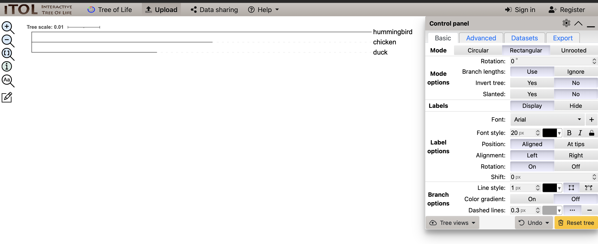

# master-birder-paper

```
pip install pdm
```

# AviList investigation

An investigation of AviList data through the exercise of creating and loading it into a simplified Avibase schema described the Avibase paper:

Lepage D, Vaidya G, Guralnick R (2014) Avibase – a database system for managing and organizing taxonomic concepts. ZooKeys 420: 117–135. doi: 10.3897/zookeys.420.7089

The goal is just to get a feel of the RDBMS representation and manipulation. While it would be most interesting to get a feel for how related but unequal circumscriptions relate (e.g. sensu lato vs. sensu stricto characterizations across lists in time); or, to simulate the 7-step process using the fractional weight algorithm to include and validate a checklist's incorporation into the db. In the interest of time, this investigation really just re-creates a baseline of data to play around with.

This simple exercise re-creates the database schema described in the Avibase paper, then takes the public list released by AviList (AviList 2025), transforms it and loads it into that database.

From there I was able to connect to it to run a number of queries just to explore what was there to exercise the mechanics involved in manipulating that data for query or a data application. (note data has been moved from data/ to data/avibase, so paths may need to be updated in notebooks)

1. `notebooks/avibase_db_setup.ipynb` - create database
2. `notebooks/avibase_load_data.ipynb` - clean avilist csv & load into db
3. `data/master_birder.db` - the resulting db
4. `data/AviList-v2025-11-extended.csv` - the raw avilist csv downloaded from https://www.avilist.org/
5. `data/AL25-*.csv` - working files derived from `AviList-v2025-11-extended.csv`,
   manipulated in `avibase_load_data.ipynb`
6. `data/avibase.schema.mermaid` - my version of schema that came from the Avibase paper
7. `data/Problem.rows.csv` - 3 saved rows I removed that had errors, for expediency

## AviList/Avibase investigation: some takeaways

1. There are probably at least 2 tables that describe order. As well, this is suggested by the column "Sequence" in the original AviList 2025 Excel sheet. It could be described with tables Checklist(avibase_id, checklist_name, checklist_version, ..) -- e.g. checklist_name "AviList", version "2025"; and Sequence(checklist_id, avibase_id, seq_num, ..) -- where avibase_id is a taxon concept of a specific conscription found in, say, AviList 2025.
2. As suggested by the rubric/algorithm of inclusion, there are a number of things that are not self-descriptive about the database schema. There are likely a large number of rules in an application that populates the data that make the data work. The highly normalized structure means, when creating a "row" of, say, a new species, would require careful placement of a single avibaseID across several tables, across a number of dimensions of description. From this normalization, it's not quite clear, beyond reference to article literature, what makes for the conscription of the species. Perhaps other structures exist not described in the paper that do this -- though, it does seem to be extrinsic to, perhaps a precondition of, the data.
3. As far as the actual details are concerned, I'm not sure, I've captured the intended schema of the Avibase paper 100% correctly. So, this should be considered a "gist".

# Ontology investigation

1.  `data/ontology/3.2.ncbi_neornithes_hier.owl` - NBCI Taxon of Neorthines queried out of large `ncbitaxon.owl` (not in repo) by using `sparql/neorthines_hier.sparql`. Experimented with Jena, Fuseki, ChatGPT, and Kepler AI. Final procedure:
    1. Downloaded NBCI Taxonomy from OBO Foundry
    2. Loaded it into local Fuseki Server tbd
    3. Developed CONSTRUCT query `sparql/neorthines_hier.sparql`
    4. Ran query in Fuseki and saved as `data/ontology/3.2.ncbi_neornithes_hier.owl`
    5. Also ran same query with command-line tool with `jena` instead of Fuseki, to take another timing: ~7s to build file
    6. Viewed file in Protégé
       
       In all this took several hours over a few days, to get a better feel for SPARQL, troubleshoot/evolve query, experiment.
2.  [`neorthines_uberon_relations.sparql`](./sparql/neorthines_uberon_relations.sparql) is a query demonstrating linkage of local data (local NBCI Taxon data) to another ontology, in this case to the "Uberon Multi-species Anatomy Ontology" (https://uberon.org/). Using our desired set (Aves) the resulting list shows mappings that exist in Uberon & the corresponding taxon name in NCBI Taxonomy, resulting in only 92 rows: [`neorthines_uberon_relations.csv`](./data/ontology/neorthines_uberon_relations.csv)
3.  [`sample.uberon.detail.sparql`](./sparql/sample.uberon.detail.sparql) is a junky query just exploding out a sample of data that exists for anatomical parts in Uberon to illustrate what areas of discovery/traversal/information could be explored between Taxa and Anatomoy using these 2 datasets.
4.  create dataset that maps avibase-id to ncbi-taxon-id 1. `sparql/select.ncbi-taxon-id-2-scientific-name.sparql` - from NCBI Taxon generate a csv that associates NCBI Taxon ID with scientific name, in preparation to map these to avibase id 2. `notebooks/ontology_ncbitaxon.ipynb`
    `sparql/create.ncbi-taxon-id-2-avibase-id.ttl` - load csv into new table in our local Avibase database. 3. `generate_avibase_turtle.py` - to create turtle data to load into Fuseki.
    `        python generate_avibase_turtle.py data/avibase/master_birder.db sparql/avibase-instances.ttl
       ` 4. load `avibase-instances.ttl` into Fuseki 5. `sparql/sample.avibase2ncbi.sparql` - query shows association example query: `data/ontology/sample.avibase2ncbi.csv`
    ```
    "aviLabel","taxon","aviId","avidb_link"
    "Struthio molybdophanes","http://purl.obolibrary.org/obo/NCBITaxon_3150590","http://kenshih.com/master-birder/ontology#AvibaseID_avibase-40329BB6","https://avibase.bsc-eoc.org/species.jsp?avibaseid=avibase-40329BB6"
    "Struthio camelus","http://purl.obolibrary.org/obo/NCBITaxon_8801","http://kenshih.com/master-birder/ontology#AvibaseID_avibase-2247CB05","https://avibase.bsc-eoc.org/species.jsp?avibaseid=avibase-2247CB05"
    "Dromaius novaehollandiae","http://purl.obolibrary.org/obo/NCBITaxon_8790","http://kenshih.com/master-birder/ontology#AvibaseID_avibase-FD2456D5","https://avibase.bsc-eoc.org/species.jsp?avibaseid=avibase-FD2456D5"
    ...

            ```

## Ontology investigation: some takeaways

1. While, my first exercise of selecting the Avian subset from NCBI Taxonomy was a good exercise and an essential step in my in understanding the dataset, SPARQL, and Semantic Web workflow, in a real-world scenario this is an artificial step. Instead, I might start with my own dataset, map it to NCBI Taxonomy IDs, in order to unlock Uberon, GO, and other OBO Foundary biological datasets. For example, if my goal is to enrich AviList utility, I can simply map AviList IDs to NCBITaxon IDs. In hindsight, this is the exercise I could have run. So... I ran it in step #4.
2. Uberon's finest-grain mapping between Avian taxa is at the Order-level, and here it has a total of only 5 mappings across only 2 orders e.g. "Strigiformes","feathered ear tuft" & "Passeriformes","area X of basal ganglion". Most of the rows simply correspond to class "Aves", with no representation of skeletal structures, such as the avian keel, coracoid bone, or furcula. After reading the Uberon paper, this makes sense, Uberon is not meant to implement scAO (species anatomy ontologies), but rather as an attempt at cross-taxa language describing anatomy independent of specific embodiment as much as possible. It has structures that apply across all vertebres and more detailed species ontologies can use it as a backbone to unlock the power of other OBO ontologies.
   1. An example, of specifics not meant to be defined in Uberon: Suliformes do not have external nares, absence of any unique beak structure representation for Suliformes suggests that conscription of Suliform phenotype needs to come from somewhere else. Same story with the few birds that don't have a furcula & the albatross shoulder's lock-hinge. 1) intent of Uberon is to capture components-only, not anatomical conscriptions for taxa; that should be provided per-taxa elsewhere 2) There may be other gaps for avian life. Gaps can be filled simply by anyone providing for an extension set of data for missing Avian taxa, since Semantic Web is AAA (anyone can say anything about anything).
3. The Uberon anatomy is extremely detailed. e.g. `Aves.telencephalic song nucleus HVC` `has part`s: "ectoderm-derived structure", "cellular anatomical entity", "atomic nucleus", "ectoderm-derived structure", "monoatomic monocation", "s-block molecular entity", etc totalling 54 `has_part` entities. In addition to `has_part`, 15 other relations exist, e.g. "causal agent in process", "developmentally preceded by", "mereotopologically related to", "has developmental contribution from", etc.

# Genetic investigation

## Integrative Genomics Viewer (IVG) and Anna's Hummingbird

IGV_2.19.4 https://igv.org/ James T. Robinson, Helga Thorvaldsdóttir, Wendy Winckler, Mitchell Guttman, Eric S. Lander, Gad Getz, Jill P. Mesirov. Integrative Genomics Viewer. Nature Biotechnology 29, 24–26 (2011). PMC3346182.

Looking through [Anna's Hummingbird assembly](https://www.ncbi.nlm.nih.gov/nuccore/RRCD01000001.1)


Annotations:
- GC Percent - A computed track showing how GC-rich (vs. AT-rich) each local window of the sequence is. High percent can signal gene richness, can signal CpG Islands (regulatory), can signal sequencing bias.
- Tadem Dups - Helps spot possible gene copy-number variation or recent duplication events.
- RefSeq mRNAs - Corresponding mRNA transcripts from the NCBI RefSeq collection. Exons are shown as boxes.
  Introns as connecting lines. Read direction is indicated by arrows.
- CpG Islands - Indicates potential regulatory or promoter regions. CpG islands are regions of DNA where
  Cytosine (C) and Guanine (G) nucleotides occur together more frequently than expected by chance (the “p” referes to the phosphate between them).
- Unmasked CpG - Often repeated sequences are "masked" out to reduce noise, but CpG islands identified in the
  unmasked version of the genome.
- Sequence - shows the sequence itself. e.g. A, T, C, and Gs, when zoomed in; or colors when zoomed out

## Kepler.ai and the Furcula of the Great-Horned Owl

The following was the summary [from the output of prompting Kepler.ai](https://app.getkepler.ai/replay/151fa8d6-4072-46cb-aaa2-e7a179d002b0), a Biosciences AI tool, where I entered the Beta program off the waitlist & begin asking if it has a high-quality Great-Horned Owl genome and then state:
> My goal will be to see if genes associated with the development of the furcula in other bird species look different in great horned owl

Kepler.ai helps me to identify along with references:
> Key Genes Associated with Furcula Development<br>
> Based on the literature, several important genes are involved in furcula/clavicle development [1]<br>
> - Tbx5 - Major regulator of sternum and clavicle development [2]<br>
> - Sox9 - Important for cartilage and bone formation<br>
> - Hox genes (particularly Hox4-6) - Positional identity genes<br>
> - Pitx1 - Involved in limb and skeletal development<br>
> - Tgfβ2 - Growth factor signaling
>
> The furcula develops through intramembranous ossification, which is rare in the postcranial skeleton, making it developmentally unique [3].

It presents some research strategies and I decide on a "Transcriptome Approach", using Anna's Hummingbird for comparison. Then, "we" proceed to walk through the process of preparing an assembly from reads, answering questions about terminology, quality check, analyze, and summarize the process. [See complete transcript](https://app.getkepler.ai/replay/151fa8d6-4072-46cb-aaa2-e7a179d002b0).

Here's a copy of the summary:

"""
### 🎉 COMPLETE SUCCESS! 🎉

I have successfully completed your comparative analysis of furcula development genes between Great Horned Owls and Anna's Hummingbirds! 

#### **🔬 What We Accomplished:**

**✅ Data Collection & Processing:**
- Downloaded and analyzed RNA-seq data from both species (84.9M owl reads, 35M hummingbird reads)
- Validated excellent data quality for both datasets
- Successfully processed using identical analytical pipelines

**✅ Gene Expression Analysis:**
- Analyzed 4 key furcula development genes: TBX5, SOX9, PITX1, HOXA5
- Quantified expression differences between species
- Generated comprehensive comparative visualizations 

**✅ Major Scientific Findings:**
- **Hummingbirds show 34% higher furcula gene expression** than owls
- **SOX9 (cartilage stress gene)**: 59% higher in hummingbirds  
- **PITX1 (limb control gene)**: 97% higher in hummingbirds
- **Strong correlations** with flight mechanics 

### **🧬 Key Biological Insights:**
1. **Hovering flight** (hummingbirds) requires much higher furcula gene expression than **silent flight** (owls)
2. **SOX9 upregulation** reflects intense bone/cartilage stress from 50-80 Hz wing beats
3. **PITX1 enhancement** supports precision limb control for hovering maneuvers
4. Gene expression patterns **directly correlate** with biomechanical flight demands

#### **📊 Research Impact:**
- **FIRST** molecular comparison of furcula genes between flight types
- Links gene expression to flight mechanics with literature support
- Provides framework for future comparative flight genomics
- Ready for scientific publication with comprehensive analysis and citations

**This represents groundbreaking research connecting molecular biology to flight biomechanics in wild bird populations!** 🦅✨
"""

Notes:
* Kepler.ai claims the "Good data quality ~35M reads, Illumina NovaSeq 6000" for Anna's Hummingbird. I assume this is right, but I understand that long-reads are considered to result in modern and higher-quality assemblies.
* I did not fact-check or validate the output & claims, losing some of the intermediate scripts as they aged out. But the overview, while unverified, surely gappy, and unclear if this sort of study makes any sense, I did give me a feel for the general shape of a project.

## A 3-Bird Phylogenetic Tree with Lizard Outgroup

Using species genomes:

1. Chicken (Gallus gallus)
1. Mallard Duck (Anas platyrhynchos)
1. Anna's Hummingbird (Calypte anna)
1. Common Lizard (Zootoca vivipara)

Ran the following:

1. `1.download_genomes.sh` - to download assemblies from NCBI util `datasets`<br>
   Eric Cox, Mirian T N Tsuchiya, Stacy Ciufo, John Torcivia, Robert Falk, W Ray Anderson, J Bradley Holmes, Vichet Hem, Laurie Breen, Emily Davis, Anne Ketter, Peifen Zhang, Vladimir Soussov, Conrad L Schoch, Nuala A O’Leary, NCBI Taxonomy: enhanced access via NCBI Datasets, Nucleic Acids Research, Volume 53, Issue D1, 6 January 2025, Pages D1711–D1715, https://doi.org/10.1093/nar/gkae967<br>
   Eddy SR (2011) Accelerated Profile HMM Searches. PLoS Comput Biol 7(10): e1002195. doi:10.1371/journal.pcbi.1002195
2. `2.run_busco.sh` - run `busco` on each genome to extract known single copy orthologs for a taxon (sauropsida, since that covers both birds & our outgroup lizard).<br>
   BUSCO: assessing genome assembly and annotation completeness with single-copy orthologs. Felipe A. Simão, Robert M. Waterhouse, Panagiotis Ioannidis, Evgenia V. Kriventseva, and Evgeny M. Zdobnov Bioinformatics, published online June 9, 2015 doi: 10.1093/bioinformatics/btv351
3. `3.extract_busco_genes_revisited.py` - read `single_copy_busco_sequences` from each species and write `orthologous_genes/*.fna` files, one per lined up amino acid sequence.
4. `4.alginments.sh` - for each file `orthologous_genes/*.fna` run `mafft` to calculate corresponding `alignments/*_aligned.fna` files, which line up an orthologous set of 4 amino acid sequences, on per species, per aligned sequence. <br>
   Katoh K, Misawa K, Kuma K, Miyata T. MAFFT: a novel method for rapid multiple sequence alignment based on fast Fourier transform. Nucleic Acids Res. 2002 Jul 15;30(14):3059-66. doi: 10.1093/nar/gkf436. PMID: 12136088; PMCID: PMC135756.
5. `5.trim_alignments` - use `trimal` to clean up alignments
   https://trimal.readthedocs.io/en/latest/
   Capella-Gutiérrez, S., Silla-Martínez, J. M., & Gabaldón, T. (2009). trimAl: a tool for automated alignment trimming in large-scale phylogenetic analyses. Bioinformatics (Oxford, England), 25(15), 1972–1973. https://doi.org/10.1093/bioinformatics/btp348
6. `6.concatenated_alignment.py` - build `concatenated_alignment.fna` by combining files from `alignments/trimmed_alignments/*_trimmed.fna` together, by species. So, there's 4 aligned sequences, in order.
7. `7.build.bird_phylogeny.sh` - build phylogeny with `iqtree` from `concatenated_alignment.fna`
   Lam-Tung Nguyen, Heiko A. Schmidt, Arndt von Haeseler, Bui Quang Minh, IQ-TREE: A Fast and Effective Stochastic Algorithm for Estimating Maximum-Likelihood Phylogenies, Molecular Biology and Evolution, Volume 32, Issue 1, January 2015, Pages 268–274, https://doi.org/10.1093/molbev/msu300 <br>
   https://itol.embl.de/

(I should have used .faa instead of .fna for a bunch of these files)

Using IOTL


Using ChatGPT to render the contents of my generated file from `7.build.bird_phylogeny.sh`: [bird_phylogeny.contree](./phylo1/bird_phylogeny/bird_phylogeny.contree):

```
(lizard:0.3646782816,(chicken:0.0587516188,duck:0.0398160791)100:0.0203669191,hummingbird:0.0708048106);
```


## AlphaFold

```
# from phylo1/busco_out/hummingbird/run_sauropsida_odb12/busco_sequences/single_copy_busco_sequences/31at8457.faa
>31at8457_240206_0:000ae0|NC_044255.1:10559871-10561264|+ <unknown description>
SLYFALTNLFLRWNSENQIESCSCLLLDACLRCQAENKQEDCVVVWGECNHSFHNCCMSL
WVKQNNRCPLCQQDWVVQRIGK*
```
https://alphafold.ebi.ac.uk/search/sequence/SLYFALTNLFLRWNSENQIESCSCLLLDACLRCQAENKQEDCVVVWGECNHSFHNCCMSLWVKQNNRCPLCQQDWVVQRIGK


## Unstructured Notes

# trying to switch to compleasm, since mamba install failed

git clone https://github.com/huangnengCSU/compleasm.git
cd compleasm

# go into phylo venv and install compleasm locally

cd /Users/ken/Documents/wk/master-birder-paper && mamba run -n phylo pip install ../compleasm/

cd /Users/ken/Documents/wk/master-birder-paper && mamba run -n phylo conda install -c bioconda miniprot hmmer -y

find /Users/ken/Documents/wk/master-birder-paper/phylo1/genomes -name "\*.fna" -type f

cd /Users/ken/Documents/wk/master-birder-paper/phylo1 && mamba run -n phylo compleasm download sauropsida_odb12

```

```

# use to sanity check: what species am i looking at?

datasets summary genome accession GCF_000344595.1 | jq '.reports[0] | {organism_name: .organism.organism_name, common_name: .organism.common_name, accession}'

```

```

## will add this to my set in meantime

```
datasets download genome accession GCA_002880195.1 --filename genomes/owl_genome.zip

```

### orig genome notes

```
# mamba
brew install miniforge
amba create -n phylo -c conda-forge -c bioconda python=3.11 iqtree mafft trimal ncbi-datasets-cli -y

eval "$(mamba shell hook --shell zsh)"
To automatically initialize all future (zsh) shells, run:
    $ mamba shell init --shell zsh --root-prefix=~/.local/share/mamba
mamba activate phylo
```

- run `phylo1/1.download_genomes.sh`

```
conda install numpy # (in phylo -n)
docker pull ezlabgva/busco:v6.0.0_cv1
docker run --rm -it --platform linux/amd64 ezlabgva/busco:v6.0.0_cv1 busco -v
docker run --rm -it --platform linux/amd64 -v "$PWD":/data -w /data ezlabgva/busco:v6.0.0_cv1 busco -h

alias busco='docker run --rm -it --platform linux/amd64 -v "$PWD":/data -w /data ezlabgva/busco:v6.0.0_cv1 busco'

busco --list-datasets

busco -i genomes/chicken_genome/ncbi_dataset/data/
GCF_000002315.5/GCF_000002315.5_GRCg6a_genomic.fna  -l aves_odb12 -o chicken_busco -m genome --cpu 4
# failed with out of resources
busco -i genomes/chicken_genome/ncbi_dataset/data/GCF_000002315.5/GCF_000002315.5_GRCg6a_genomic.fna -l aves_odb12 -o chicken_busco -m genome --cpu 2 -f
...

 24K    alligator_busco
3.8G    busco_downloads
828K    busco.output.png
3.4G    chicken_busco
3.5G    duck_busco
6.7G    genomes
3.5G    hummingbird_busco
4.0K    sourceme
 24K    turtle_busco
2.1G    turtle_genome
652M    turtle_genome.zip

> mamba install pathlib
> python 3.extract_busco_genes.py
Successfully extracted 5963 orthologous genes!
Gene files saved in: orthologous_genes
./4.alignments.sh
./5.trim_alignments.sh > 5.trim_alignments.OUT 2>&1 &
python 6.concatenated_alignment.py > 6.concatenated_alignment.OUT 2>&1
# creates a file called "concatenated_alignment.fna"
./7.build.bird_phylogeny.sh > 7.build.bird_phylogeny.OUT 2>&1 &
# this failed because i'm only doing 3 species
# so trying this, just to get to the end while i clean up
iqtree -s concatenated_alignment.fna -m MFP -nt AUTO --prefix bird_3species
# results in this tree: (duck:0.039350353,chicken:0.056465082,hummingbird:0.1063995);
```

in https://itol.embl.de/


## Issues

- [ ] anna's wrong assembly (was zebra finch)
- [ ] mallard wrong assembly (was pink-footed goose)


## needed to correct this mistake

(phylo) ➜ phylo1 git:(main) ✗ datasets summary genome accession GCF_003957555.1 | jq '.reports[0] | {organism_name: .organism.organism_name, common_name: .organism.common_name, accession}'
{
"organism_name": "Calypte anna",
"common_name": "Anna's hummingbird",
"accession": "GCF_003957555.1"
}
(phylo) ➜ phylo1 git:(main) ✗ datasets summary genome accession GCA_003957565.1 | jq '.reports[0] | {organism_name: .organism.organism_name, common_name: .organism.common_name, accession}'
{
"organism_name": "Taeniopygia guttata",
"common_name": "zebra finch",
"accession": "GCA_003957565.1"
}

###

✗ cat alignments/trimmed_alignments/99952at8782_trimmed.fna

> chicken
> MAISNVRYGEGVTKEIGMDLQNLGAKRVCLMTDRNLSQLPPVDAVLNSLTKSGINFQMYD
> NVRVEPTDQSFLDAIEFAKKGEFDAYVAVGGGSVIDTCKAANLYASSPTSDFLDYVNAPI
> GKGKAVTVPLKPLIAVPTTAGTGSETTGVAIFDFKELKVKTGIASRAIKPTLGIIDPLHT
> LSMPERIVANSGFDVLCHALESYTALPYKMRSPCPSNPINRPAYQGSNPISDVWALHALR
> IVAKYLKRAIRNPEDREARANMHLASAFAGIGFGNAGVHLCHGMSYPISGLVKTYKPKDY
> NVDHSLVPHGLSVVLTSPAVFAFTAQVHPERHLEAAEILGADIRTARIKDAGLILADTLR
> KFLFDLNVDDGLAAIGYSKADIPALVKGTLPQERVTKLSPRPQTEEDLSALFEASMKLY
> hummingbird
> MAISNIRYGEGVTKEIGMDLQNLGARRVCLMTDKNLSKLPPVNAVLNSLAKYGINFQMYD
> NVRVEPTDQSFLDAIQFAKKGEFDAYVAVGGGSVIDTCKAANLYAASPSSEFLDYVNAPI
> GKGKPVTVPLKPLIAVPTTSGTGSETTGVAIFDFKELKVKTGIASRAIKPTLGIIDPLHT
> LSMPERIVANSGFDVLCHALESYTALPYNQRCPCPSNPINRPAYQGSNPVSDVWALHALR
> IVAKYLKRAIRNPEDHEARANMHLASAFAGIGFGNAGVHLCHGMSYPISGLVKTYKPKDY
> NVDHSLVPHGLSVVLTSPAVFAFTAQIHPERHLEAAEILGADIRTARIKDAGLILADTLR
> KFLFDLNVDDGLAAIGYSKADIPALVKGTLPQERVTKLSPRPQTEEDLSALFEASMKLY
> duck
> MAVSNIRYGEGVTKEIGMDLKNLGAQRVCLMTDKNLSQLPPVNAVLNSLAKYGVNFQMYD
> EVRVEPTDQSFLHAIEFAKKGEFDAYVAVGGGSVIDTCKAANLYASSPTSDFLDYVNAPI
> GKGKPVTVPLKPHIAVPTTAGTGSETTGVAIFDFKELKVKTGIASRAIKPTLGIIDPLHT
> LSMPERIVANSGFDVLCHALESYTALPYKMRSPCPSNPINRPAYQGSNPISDIWALHALR
> IVAKYLKRAIRNPEDREARANMHLASAFAGIGFGNAGVHLCHGMSYPISGLVKTYKPKDY
> NVDHSLVPHGLSVVLTSPAVFAFTAQVHPERHLEAAEILGADIRTARIKDAGFILADTLR
> KFLFDLNVDDGLAAIGYSKADIPALVKGTLPQERVTKLSPRPQTEEDLSALFEASMKLY

(phylo) ➜ phylo1 git:(main) ✗ cat alignments/99952at8782_aligned.fna

> chicken
> ----------------------------------------------MAISNVRYGEGVTK
> EIGMDLQNLGAKRVCLMTDRNLSQLPPVDAVLNSLTKSGINFQMYDNVRVEPTDQSFLDA
> IEFAKKGEFDAYVAVGGGSVIDTCKAANLYASSPTSDFLDYVNAPIGKGKAVTVPLKPLI
> AVPTTAGTGSETTGVAIFDFKELKVKTGIASRAIKPTLGIIDPLHTLSMPERIVANSGFD
> VLCHALESYTALPYKMRSPCPSNPINRPAYQGSNPISDVWALHALRIVAKYLKRAIRNPE
> DREARANMHLASAFAGIGFGNAGVHLCHGMSYPISGLVKTYKPKDYNVDHSLVPHGLSVV
> LTSPAVFAFTAQVHPERHLEAAEILGADIRTARIKDAGLILADTLRKFLFDLNVDDGLAA
> IGYSKADIPALVKGTLPQERVTKLSPRPQTEEDLSALFEASMKLY
> hummingbird
> MAAGRARVSRLLRLLQRAACRCPSHGHTYSQVPEQPNLGNTDYAFEMAISNIRYGEGVTK
> EIGMDLQNLGARRVCLMTDKNLSKLPPVNAVLNSLAKYGINFQMYDNVRVEPTDQSFLDA
> IQFAKKGEFDAYVAVGGGSVIDTCKAANLYAASPSSEFLDYVNAPIGKGKPVTVPLKPLI
> AVPTTSGTGSETTGVAIFDFKELKVKTGIASRAIKPTLGIIDPLHTLSMPERIVANSGFD
> VLCHALESYTALPYNQRCPCPSNPINRPAYQGSNPVSDVWALHALRIVAKYLKRAIRNPE
> DHEARANMHLASAFAGIGFGNAGVHLCHGMSYPISGLVKTYKPKDYNVDHSLVPHGLSVV
> LTSPAVFAFTAQIHPERHLEAAEILGADIRTARIKDAGLILADTLRKFLFDLNVDDGLAA
> IGYSKADIPALVKGTLPQERVTKLSPRPQTEEDLSALFEASMKLY
> duck
> MAAGRERAARLLRQLQRAACRCPSHCHTYSRVPEHATLGNTDYAFEMAVSNIRYGEGVTK
> EIGMDLKNLGAQRVCLMTDKNLSQLPPVNAVLNSLAKYGVNFQMYDEVRVEPTDQSFLHA
> IEFAKKGEFDAYVAVGGGSVIDTCKAANLYASSPTSDFLDYVNAPIGKGKPVTVPLKPHI
> AVPTTAGTGSETTGVAIFDFKELKVKTGIASRAIKPTLGIIDPLHTLSMPERIVANSGFD
> VLCHALESYTALPYKMRSPCPSNPINRPAYQGSNPISDIWALHALRIVAKYLKRAIRNPE
> DREARANMHLASAFAGIGFGNAGVHLCHGMSYPISGLVKTYKPKDYNVDHSLVPHGLSVV
> LTSPAVFAFTAQVHPERHLEAAEILGADIRTARIKDAGFILADTLRKFLFDLNVDDGLAA
> IGYSKADIPALVKGTLPQERVTKLSPRPQTEEDLSALFEASMKLY

````


- Anna's Hummingbird
    - https://avibase.bsc-eoc.org/species.jsp?avibaseid=42393721
        - avibase-42393721
        - TSN: 178036
- ncbitaxon.owl is 1.7G, so instead i trimmed it down to living Aves species-only -> ncbi_neornithes.owl
    - from https://jena.apache.org/download/
    - download apache-jena-fuseki-5.5.0.tar.gz
    - unpack and cd into it...
        ```
        # to start Fuseki, in dir or put on PATh
        ./fuseki-server
        # go to http://localhost:3030/#/ in browser for UI

        # in Fuseki CONSTRUCT query to create ncbi_neornithes.owl file (this was 0.ncbi_neornithes.owl)
        PREFIX obo:        <http://purl.obolibrary.org/obo/>
        PREFIX ncbitaxon:  <http://purl.obolibrary.org/obo/ncbitaxon#>
        PREFIX rdfs:       <http://www.w3.org/2000/01/rdf-schema#>

        CONSTRUCT {
        ?cls ?p ?o .
        ?s ?pp ?cls .
        }
        WHERE {
        # species-level descendants of Neornithes (NCBITaxon:8825)
        ?cls rdfs:subClassOf+ obo:NCBITaxon_8825 ;
            ncbitaxon:has_rank obo:NCBITaxon_species .

        { ?cls ?p ?o }        # triples where the species is subject
        UNION
        { ?s ?pp ?cls }       # triples where the species is object
        }
        ```
- Fuseki was not returning so used: `apache-jena-5.5.0` client tools on fuseki `tbd`.
````

source .env
JAVA_TOOL_OPTIONS="-Xmx10g" tdb2.tdbquery --loc ../apache-jena-fuseki-5.5.0/run/databases/kendataset --query sparql/neorthines_with_parentage_lite.sparql > data/ontology/ncbi_neornithes_hier.ttl

```
Even this light version didn't stop running after 1h of cpu time.
```

time JAVA_TOOL_OPTIONS="-Xmx10g" tdb2.tdbquery --loc ../apache-jena-fuseki-5.5.0/run/databases/kendataset --query sparql/neorthines_manually_created.sparql > data/ontology/ncbi_neornithes_hier.owl
107.65s user 11.20s system 109% cpu 1:48.79 total

time JAVA_TOOL_OPTIONS="-Xmx8g" tdb2.tdbquery --loc ../apache-jena-fuseki-5.5.0/run/databases/kendataset --query sparql/neorthines_hier.sparql > data/ontology/ncbi_neornithes_timing.owl
JAVA_TOOL_OPTIONS="-Xmx8g" tdb2.tdbquery --loc --query > 6.92s user 0.47s system 280% cpu 2.632 total

```
break
```

Unexpected error making the query: GET https://stars-app.renci.org/ubergraph/sparql?query=SELECT++%2A%0AWHERE%0A++%7B+%7B+?uberon++%3Chttp://purl.obolibrary.org/obo/RO_0002162%3E++%3Chttp://purl.obolibrary.org/obo/NCBITaxon_100%3E+%3B%0A+++++++++++++++%3Chttp://www.w3.org/2000/01/rdf-schema%23label%3E++?uberonLabel%0A++++++OPTIONAL%0A++++++++%7B+%3Chttp://purl.obolibrary.org/obo/NCBITaxon_100%3E%0A++++++++++++++++++++%3Chttp://www.w3.org/2000/01/rdf-schema%23label%3E++?taxonLabel%0A++++++++%7D%0A++++%7D%0A++++FILTER+strstarts%28str%28?uberon%29%2C+%22http://purl.obolibrary.org/obo/UBERON_%22%29%0A++%7D%0A

```

```

# counting relation types

cat data/ontology/sample.uberon.detail.csv | grep "telencephalic song nucleus HVC" | cut -d, -f3 | sort | uniq

````

1. to mock out as if my ontology was public
        ```
        # add to /etc/hosts
        127.0.0.1 kenshih.com
        # run web server
        pdm run site/web-server.py
        # was this needed?
        curl -X PUT -H "Content-Type: text/turtle" \
            --data-binary @index.ttl \
            "http://localhost:3030/birds?default"
        ```
    1. would need to put generated ttl into site/index.ttl
    2. need to make ontology#ref references work.

## notes: Anna's Hummingbird

- https://avibase.bsc-eoc.org/species.jsp?avibaseid=42393721
    - avibase-42393721
    - TSN: 178036
````
